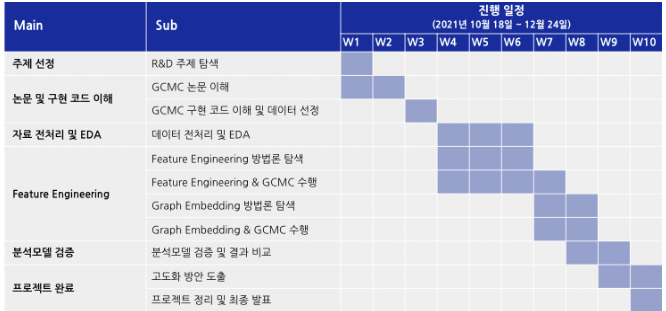
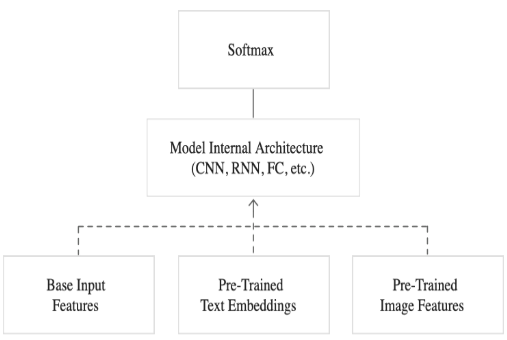
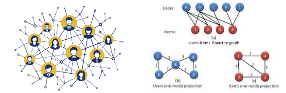
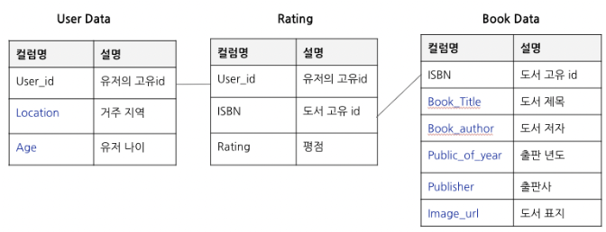
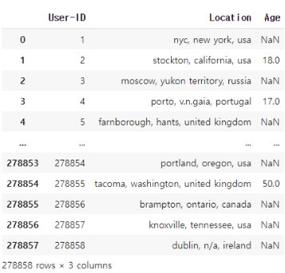
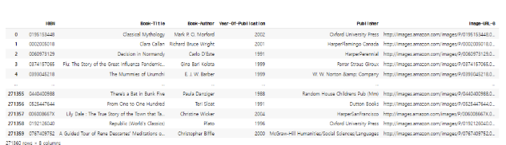
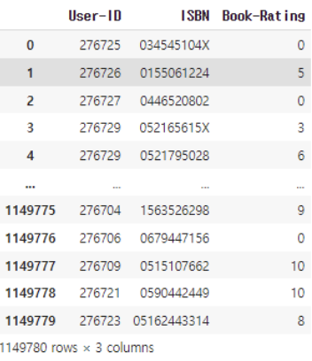
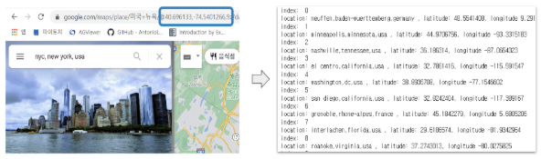

# GCMC_recommendation

## Introduction

### 연구 목표

GCMC 논문을 이해하고 이를 구현한 소스 코드를 활용하여 실 고객 데이터 기반, 각 노드의 특징을 포함한 추천 시스템 환경을 구축하고 도커 이미지로 배포한다.

구체적으로는 다음과 같다.

1. GCMC 방법론의 이해 및 분석 수행
2. 도서 평점 데이터를 이용, 유저와 도서의 특징을 활용한 GCMC 추천시스템 구현
    - 사용자와 도서의 정보가 들어있는 테이블을 이용
    - 피처 엔지니어링 및 그래프 관점의 임베딩을 이용한 특징벡터를 생성해 유저, 도서 노드의 특징을 포함한 추천시스템 구현
    - 결과(평가 지표) 분석
3. 구현된 분석 환경을 도커의 이미지화
4. 정리된 코드를 Github에 업로드해 GCMC 추천시스템 환경 구축

### 연구 일정

    

## 논문 소개

### Idea

- Graph 구조의 방법론을 추천 시스템 중 Matrix Factorization에 투영
- user-item rating matrix를 graph 구조로 표현
- 데이터를 matrix가 아닌 graph로 표현한 것만 제외하면, 풀고자 하는 문제는 matrix factorization과 본질적으로 동일 (추천 시스템에서의 matrix completion 문제를 "link prediction on graph" 관점에서 해결)

### 참고 문서

<a href="https://github.com/museongkim0/GCMC_recommendation/blob/main/Reference/GCMC%20%EC%B6%94%EC%B2%9C%EC%95%8C%EA%B3%A0%EB%A6%AC%EC%A6%98.docx">Graph Convolutional Matrix Completion(GCMC) 정리</a>

## Process
### 특징 벡터(Feature Vector) 추출 방법

 <b> 1. Multi-modal </b> 

노드 테이블에 존재하는 텍스트, 이미지 등의 특징들을 함께 사용하기 위해 Multi-modal을 사용한다.

    

 <b> 2. Graph Embedding </b> 

소셜네트워크, 지식그래프와 같이 유저, 아이템 각각의 그래프를 생성하고 centrality, 그래프 임베딩(gnn, node2vec 등)을 통해 특징 벡터를 추출하여 분석을 진행한다.

    

### 데이터 소개
데이터는 Kaggle의 Book Recommendation Dataset <a href="https://www.kaggle.com/datasets/arashnic/book-recommendation-dataset">(Link)</a>을 활용하였다. 데이터는 총 세가지로, 유저의 정보 데이터와 책의 정보 데이터, 유저가 책에 남긴 평점 데이터이다.

    

 <b> User Data </b> 

User Data는 총 278,858개의 레코드가 존재하며 int type의 User-ID, string type의 Location, float type의 Age로 구성되어 있다.

    

 <b> Book Data </b> 

Book Data의 경우 총 271,360개의 레코드가 존재하며 string type의 ISBN, Book-Title, Book-Author, Publisher, Image-URL-S, Image-URL-M, Image-URL-L, int type의 Year-Of-Publication으로 구성되어 있다.

    

 <b> Rating Data</b> 

Rating Data의 경우 총 1,149,780개의 레코드가 존재하며, User Data의 User-ID, Book Data의 ISBN, 0-10 사이의 int 값인 Book-Rating으로 구성되어 있다.

    

### 전처리 및 EDA
데이터의 전처리 및 EDA는 R&D의 목적성과 시간 관계상 kaggle의 다른 전처리와 EDA 예시를 참고하여 최대한 간결하게 진행했다. 	

 <b> User Data </b> 

User Data의 경우, 결측치는 다음과 같다.

| Column   | Missing Values |
|----------|----------------|
| User-ID  | 0              |
| Location | 92             |
| Age      | 110762         |

어느 컬럼 중 하나라도 결측치가 존재하는 레코드 수는 ​​110,802이며, 이를 모두 제거한 User Data의 레코드 수는 168,056이다.

 <b> Book Data </b> 

Book Data의 경우, 결측치는 다음과 같다.

| Column              | Missing Values |
|---------------------|----------------|
| Book-Title          | 0              |
| Book-Author         | 1              |
| Year-Of-Publication | 0              |
| Publisher           | 2              |
| Image-URL-S         | 0              |
| Image-URL-M         | 0              |
| Image-URL-L         | 3              |

결측치를 모두 ‘unknown’으로 대치한 뒤, 출판 연도가 0인 4,618개의 레코드를 제거했다. 이후, 값이 하나씩 밀려들어가 있는 레코드 값을 올바르게 대치해 준 Book Data의 레코드 수는 총 266,742이다.		

 <b> Rating Data </b> 
	

User Data와 Book Data의 전처리를 진행하면서 삭제된 User와 Book의 ID는 Rating에서도 제거해주어야 한다.

제거된 후 Rating의 총 레코드 수는 742,830이며, 평점이 0인 477,365건을 추가적으로 제거했다.
 
데이터가 지나치게 sparse해지는 것을 방지하기 위해 10권 이상의 책에 평점을 남긴 유저와 받은 평점이 10개 이상인 책만을 추출하여 최종적으로 265,465개의 레코드를 가진 Rating Data와 4353개의 User Data, 2160개의 Book Data를 추출하였다.

### Feature Engineering
특징 벡터를 추출하기 위한 작업으로, 크게 Multimodal으로 특징 벡터를 추출하는 방식과  그래프 임베딩 아이디어를 이용하여 추출하는 방식으로 진행한다. 전자의 경우 유저의 특징 벡터와 책의 특징 벡터의 차원을 맞춰주기 위해 3가지 방식으로 스케일을 조정해 주었으며, 후자의 경우 2가지 아이디어로 특징 벡터를 추출했다. 

즉, 총 5가지의 특징 벡터를 포함해 GCMC를 수행하고 각 방식 간의 유의미한 차이가 있는지 확인하고자 한다.

 <b> User Data </b> 

User Data의 경우 Location과 Age 두 가지 컬럼이 존재하므로 Multimodal 개념을 적용하지 않고 Location 컬럼에 대한 크롤링만 진행한다.  

**위치 정보 크롤링**

User의 Location 컬럼의 경우,  ‘도시, 국가'의 형식의 문자열로 구성되어 있다. 그러나 아래의 ‘nyc, new york, usa’와 같이 같은 표현이 중복되기도 하며 일관적이지 않다는 것을 확인했다. 이를 구글맵에 검색해 위도와 경도를 추출하는 방식으로 가공한다면 지리적인 특성을 보다 반영하고 일관성을 유지할 수 있을 것이라고 판단해 크롤링을 진행하였다.

크롤링에 앞서, 문자열에서 ‘n/a’ 표현이나 불필요한 문장 부호를 제거해주었으며 크롤러는 구글맵에 가공된 문자열을 포함해 위치 정보를 검색하면 약 5초 뒤에 url이 변경되며 위도와 경도 정보를 포함하는 것을 이용해 제작하였다. <a href="https://github.com/museongkim0/GCMC_recommendation/blob/main/Preprocessing/Location_Crawling.ipynb">(Link)</a>

    

  

**Scaling**

StandardScaler를 이용해 각 컬럼별 데이터의 스케일을 맞춰주는 작업을 진행했다.	

 <b> Book Data </b> 

Multimodal
Book Data에서 Book Title 컬럼은 Text Embedding을, Image-URL컬럼은 Image Embedding을, Book Author, Publisher는 Categorical Embedding을 진행하고 Publication_year의 경우 StandardScaler를 이용해 스케일을 조정해주었다.

Text Embedding
SBERT의 clip-ViT-B-32모델을 이용해 임베딩을 진행했다. 위 모델은 이미지와 텍스트를 같은 벡터 공간으로 임베딩하는데 유용하다. 텍스트 임베딩 벡터의 차원은 512이다.

Image Embedding
Image-URL컬럼의 경우 이미지를 다운로드 받을 수 있는 링크로 구성되어 있다. 이를 다운로드받아 리스트에 append하며 이미지가 존재하지 않는 경우 검정 이미지를 생성해 이를 append해주었다. 임베딩 결과는 텍스트 임베딩 벡터와 마찬가지로 한 이미지가 512개의 값으로 표현된다.

Categorical Embedding
Author와 Publisher의 경우 고유값 리스트를 생성한 뒤, binary encoder를 이용해 인코딩을 진행했다. binary encoder를 이용하면 one-hot encoding을 이용하는 것보다 dense한 벡터를 추출할 수 있다. 임베딩 결과 author는 8개, publisher는 10개의 이진 벡터를 추출했다.

Dimension Scaling
특징 벡터를 포함해 GCMC를 수행하기 위해서는 유저와 책의 특징 벡터의 열의 차원을 통일시켜주어야 한다. User의 특징 벡터의 경우 3, Book의 특징 벡터의 경우 1042이므로 이를 통일된 D로 스케일링하는 것을 목적으로 한다.

본 R&D에서는 PCA. Neural Network, Variational AutoEncoder의 세 가지 방식으로 차원을 통일하고자 한다.

PCA
PCA(Principal component analysis)는 고차원의 데이터를 저차원의 데이터로 환원시키는 데 사용되며 표본의 차이를 가장 잘 나타내는 성분들로 분해하는 기법이다.
PCA의 경우 User Data의 열 차원 수에 맞춰 주성분의 수를 3으로 설정하였다.

Variational AutoEncoder
VAE는 기존 데이터의 확률 분포를 유지하여 새로운 데이터를 생성하는 모델이다. VAE의 경우 PCA와 마찬가지로 User Data의 열 차원 수에 맞춰 주성분의 수를 3으로 설정하였다.

Neural Network
NN을 이용한 방식은 앞선 두가지 방식과는 다르게 User와 Book의 특징 벡터 차원을 9로 설정하였다. User의 경우 3에서 9차원으로 차원이 증가하며, Book의 경우 1042에서 9차원으로 축소된다. 

 <b> Book Data </b> 

Graph Embedding
기존의 분석방법론에서 아이디어는 유저, 북 각각의 소셜네트워크나 지식그래프를 그래프 임베딩을 통해 side information으로 이용하여, feature engineering을 통해 구한 특징벡터와 함께 사용하는 것이었다. 
하지만 해당 데이터의 유저, 북 테이블을 이용하여 별도의 소셜 네트워크, 지식그래프를 형성하는 것은 불가하다고 판단하여 그래프 임베딩을 feature vector로 사용하는 2가지 아이디어를 이용해 분석을 진행한다.

Idea1

User/Book Feature를 이용하여 유사도를 계산한 후 fully connected 그래프를 형성한다. 그리고 유사도가 비슷한 노드가 가깝게 위치하도록 그래프 임베딩을 진행한다.

Idea 2

User/Book Feature를 이용하여 그래프를 형성한 후 node2vec을 이용하여  유사한 노드가 가깝게 위치하도록 그래프 임베딩을 진행한다.

### 분석 수행 

두 가지의 방법으로 데이터를 추출하여 분석을 수행한다.

 <b> Book Data </b> 

10권 이상의 책에 평점을 남긴 유저 & 10명 이상의 유저가 평점을 남긴 책 데이터

edge가 많은 node를 추출하여 많은 연결성과 정보를 바탕으로 콜드 스타트 문제를 보완하여 학습시킨다.

Feature Vector가 없는 경우

Multi modal - PCA

		
Multi modal - VAE
		
Multi modal - Neural network

Graph Embedding Idea1

Graph Embedding Idea2

 <b> Book Data </b> 

1~10점의 평점이 고르게 분포된 데이터

기존의 데이터는 점수별 불균형 문제를 고려하지 않았으므로 가장 레코드 수가 적은 1점의 레코드 수 870에 맞춰 총 8700개의 데이터를 추출했다. 점수가 고르게 분포된 데이터를 이용하여 클래스 불균형의 문제를 보완하여 학습시킨다.

Feature Vector가 없는 경우

Multi modal - PCA

Multi modal - VAE

Multi modal - Neural network

Graph Embedding Idea2

### 결과 분석 및 비교

 <b> Book Data </b> 

10권 이상의 책에 평점을 남긴 유저 & 10명 이상의 유저가 평점을 남긴 책 데이터

[성능] 대체적으로 모든 방법의 Test RMSE가 3점에서 시작되어 2점으로 끝나는 비슷한 성능을 보였음

Feature Engineering에서 그래프 임베딩을 통해 특징벡터를 추출하는 그래프 임베딩 아이디어2 방법이 가장 좋은 성능을 보임.
이는  node2vec을 이용하여 그래프의 구조적인 관점에서 유사한 노드를 가까운 위치에 임베딩 한 것이 결과에 긍정적인 영향을 미쳤다는 것을 확인할 수 있음

[과적합] rmse가 줄어들다가 어느순간부터 늘어나는 추세를 보이는 부분은 트레인셋에 오버피팅이 되었다고 생각할 수 있고 적절한 epoch설정이 필요로해 보임

[optimizer] epoch 0~200에서 급격하게 학습이 되는 것을 알 수 있고 이는 optimizer Adam의 특성에 부합한다고 볼 수 있음

[클래스 불균형] 예측값과 실제 값을 출력해 본 결과 대부분 5 이상의 값으로만 예측을 하며 낮은 점수에 대해 예측 성능이 낮은 것을 확인하였고, 본 데이터에 5-10점의 데이터가 많음에도 불구하고 클래스 불균형 문제를 고려하지 않은 결과라고 판단됨

1~10점의 평점이 고르게 분포된 데이터
[과적합] 트레인셋은 계속 학습이 되는 반면, 테스트셋은 성능이 점점 떨어지는 것을 보아 트레인셋에 과적합 되어가고 있다고 유추할 수 있음. 

[데이터] 클래스 불균형 문제를 해결했기 때문에 불균형한 A 데이터에 비해 성능이 향상될 것이라고 예측했으나 가정이 만족되지 않았음. 
이는  A의 데이터와 달리 데이터의 양 자체도 크게 감소하였으며  여러 유저에게 평점을 받은 아이템이 없어 그래프가 sparse해졌기 떄문에 edge에 대한 encoder에서의 학습이 부족해 결과가 좋지 않았다고 생각됨.

[cold start] sparse한 그래프에서 feature vector, 그래프 임베딩을 이용하면 cold start 문제를 어느정도 보완할 수 있을 것이라 생각하였지만 이를 이용한 분석에서도 좋지 않은 성능을 보임.
이는 로우 데이터를 잘 나타내는 Feature Engineering을 하지 못하였거나 데이터가 부족하여 결과가 좋지 않았다고 생각됨.

 <b> Book Data </b> 

하이퍼 파라미터 튜닝

다음은 고도화를 위해 진행한 모델의 하이퍼파라미터 튜닝 결과이다.
하이퍼 파라미터 튜닝은 A(10권 이상의 책에 평점을 남긴 유저 & 10명 이상의 유저가 평점을 남긴 책 데이터) 데이터에 한해서 진행하였다.

이를 통해 Optimizer인 Adam의 특성상 Epoch가 150~200쯤에서 대부분의 학습이 이루어지며 Learning Rate는 값이 작을 수록 학습률이 높아지고 hidden layer의 수가 많을수록 학습이 잘 되며 Drop out이 작을 수록 학습이 잘 된다는 결론을 내릴 수 있었으며 최종 RMSE를 1.67로 모델의 성능을 더욱 향상 시킬 수 있었다.
Hidden Layer, Drop out과 같은 하이퍼파라미터는 성능과 계산량이 Trade Off 관계이므로 값이 클수록 학습이 잘되지만 시간이 오래 걸리기 때문에 지금보다 더욱 많은 데이터를 다룰 때에는 어느정도의 성능을 포기하더라도 계산량을 줄이는 등 적절한 튜닝이 필요함을 알 수 있었다.

### Conclusion

 <b> 결론 </b> 

관계가 많은 첫번째 데이터에서 모든 방법이 전체적으로 학습이 잘 이루어지고, Graph Embedding Idea 2가 가장 좋은 성능을 가진 결과를 통해 기존의 논문에서 GCN을 이용해 주변의 정보를 Latent Vector로 generalization하여 분석을 수행하면 유저와 아이템의 Densed Feature를 사용할 수 있어 더 좋은 성능의 결과를 도출할 수 있을 것이라는 가설을 충족할 수 있었다.

반면에 클래스 불균형을 해결한 sparse한 두번째 데이터에서 학습이 거의 이루어지지 않은 결과를 통해 기존의 논문에서 Feature Engineering을 통해 Cold Start문제를 보완할 수 있을 것이라는 가설이 충족되지 않음을 알 수 있었다. 하지만 이는 Feature Engineering과정에서 Multimodal을 사용하는 과정과 Dimension Scaling 과정에서 적절한 하이퍼파라미터 튜닝을 통해 최종 Feature Vector가 로우 데이터를 잘 설명하는지 검증을 하는 과정이 생략되었고, 전체 데이터를 이용한 학습이 아닌 데이터의 일부를 추출하여 적은 양의 데이터로 학습을 하였기 때문에 아직 가설이 틀렸다고 말할 수 없는 부분이다. 추후에 이러한 과정 이후에도 학습이 제대로 이루어지지 않는다면 논문의 가설은 충족되지 않는다고 결론을 내릴 수 있을 것이다.

 <b> 고도화 방안 </b> 

**A. Feature Engineering 과정에서의 하이퍼 파라미터 튜닝**

1. Node2Vec
2. PCA
3. VAE
4. Neural Net

특징을 추출하는 과정에서 추출된 특징이 로우데이터를 잘 설명하도록 하이퍼파라미터 튜닝이 필요함

**B. GCMC 모델에서의 하이퍼 파라미터 튜닝**

1. Epoch
2. Learning Rate
3. Hidden Layer
4. Drop Out
5. Accumulation Function

각 데이터에 적합한 모델의 하이퍼파라미터 설정을 통해 향상된 결과를 도출할 수 있음

**C. 보다 많은 데이터를 수집해 지식 그래프 생성**

ex) 책 정보를 크롤링하여 장르 데이터 추가 수집/유저 간 연결망.. 

**D. 그래프 오버샘플링 방법 탐색**

기존의 오버샘플링 방법은 새로운 관계를 생성해야하는 본 분석문제에 적합하지 않으므로 그래프적 관점의 오버샘플링 방법 탐색 필요

ex) Graph SMOTE

**E. 실 고객 데이터 기반의 GCMC 수행**

ex) 유저 간의 소셜네트워크, 아이템의 지식그래프를 별도로 생성 가능한 충분한 데이터

충분한 데이터를 통해 유저와 아이템 사이의 평점 그래프 외에도 유저 간의 소셜 네트워크, 아이템 간의 지식 그래프 등을 생성할 수 있다면 GNN, GCN, GraphSAGE 등 다양한 그래프 임베딩을 통해 그래프의 정보를 담아 Cold Start문제를 보완할 수 있을 것이라 예상됨

